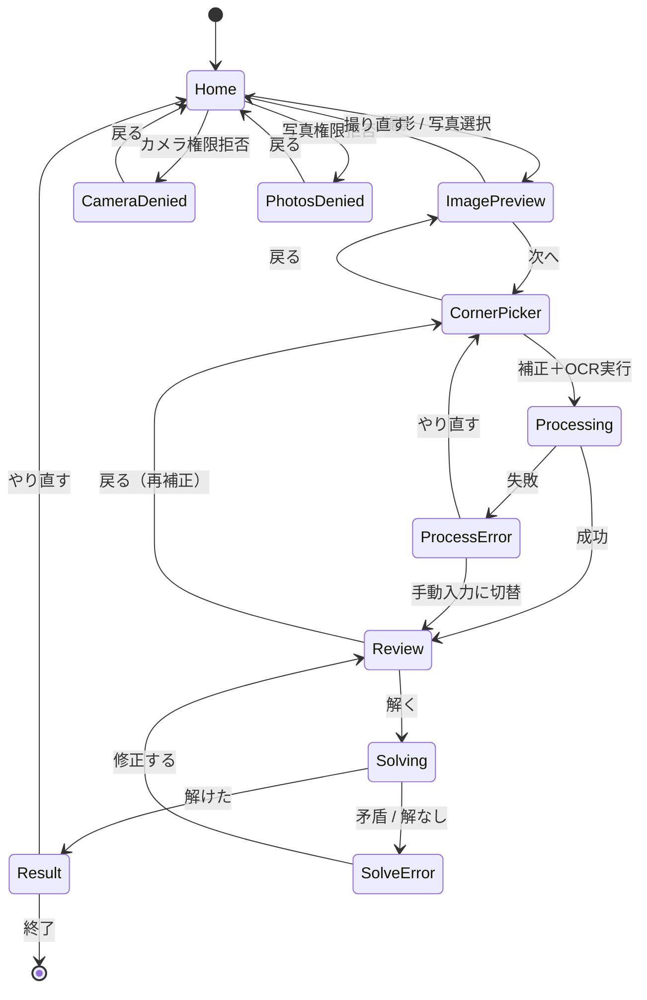

# UI設計

最終更新: 2026-05-04

このドキュメントは画面遷移、各画面のレイアウト案、共通コンポーネント、デザイントークンをまとめる。実装時の唯一参照ソース。新しい画面や仕様変更が出たら本ファイルを先に更新する。

## 目次

1. [画面遷移図](#1-画面遷移図)
2. [画面一覧](#2-画面一覧)
3. [各画面のレイアウト案](#3-各画面のレイアウト案)
4. [共通UIコンポーネント](#4-共通uiコンポーネント)
5. [デザイントークン](#5-デザイントークン)
6. [アクセシビリティ要件](#6-アクセシビリティ要件)
7. [未決事項・残課題](#7-未決事項残課題)

---

## 1. 画面遷移図



### 主要フロー（ハッピーパス）

`Home → ImagePreview → CornerPicker → Processing → Review → Solving → Result → Home`

### 戻る／やり直すの一貫ルール

- **画面左上**: ハードウェア戻るに準じた1段戻り
- **主要アクション**: 画面下部の親指リーチ範囲に固定
- **やり直す**: Result/エラー画面でホームに戻る導線を明示

---

## 2. 画面一覧

| ID | 画面名 | 主要要素 | 関連Phase |
|----|--------|----------|-----------|
| Home | ホーム | 撮影／写真選択ボタン、説明 | 3 |
| ImagePreview | 画像プレビュー | 取得画像、撮り直す／次へ | 3 |
| CornerPicker | 4隅指定 | 画像＋4つのドラッグハンドル | 4 |
| Processing | 処理中 | プログレス、キャンセル | 4–5 |
| Review | レビュー＆修正 | 9×9グリッド、数字入力UI | 6 |
| Solving | 解析中 | プログレス、キャンセル | 6 |
| Result | 結果 | 解答グリッド | 6 |
| CameraDenied | カメラ権限拒否 | 設定アプリ誘導 | 7 |
| PhotosDenied | 写真権限拒否 | 設定アプリ誘導 | 7 |
| ProcessError | 処理エラー | 失敗理由、リトライ／手動入力 | 7 |
| SolveError | 解析エラー | 入力不正／解なし、Reviewへ戻る | 7 |

---

## 3. 各画面のレイアウト案

レイアウトはすべて **縦持ち（portrait）固定** を前提とする。横持ちは v1 では対応しない。

### 3.1 Home

#### 案B（採用）: ヒーロー＋並列ボタン

```
┌──────────────────────────┐
│ 数独カメラ                  │
├──────────────────────────┤
│                          │
│    ┌──────────────┐      │
│    │ ヒーロー画像   │      │
│    │ （数独問題写真）  │      │
│    └──────────────┘      │
│                          │
│    数独問題を解こう        │
│    撮るだけで答えが出ます    │
│                          │
│  ⓘ 印刷物の数独に対応       │ <- 補足（小）
│                          │
├──────────────────────────┤
│ [📷 撮影]   [🖼️ 選ぶ]     │ <- 横並び（下部固定）
└──────────────────────────┘
```

- **長所**: アプリ目的が伝わりやすい / ヒーロー画像でブランディング可能
- **短所**: 横並びボタンは片手操作で押し分けにくい
- **採用理由**: ユーザー指定（2026-05-04）
- **短所の緩和策**:
  - ボタンを画面下部の安全領域内に固定し、左右いっぱいに配置（最低タップ幅 1/2 - 余白 16pt）
  - ボタン高さは 56pt 以上（HIG最小 44pt + 余裕）
  - 主要アクション（📷 撮影）を左側に配置（右利き想定の親指リーチ最適）
  - アイコン＋ラベルで誤タップ防止

#### 案A（不採用）: 縦並び大型カード

```
┌──────────────────────────┐
│ 数独カメラ                  │
├──────────────────────────┤
│   ┌────────────────────┐ │
│   │   📷 撮影する        │ │
│   └────────────────────┘ │
│   ┌────────────────────┐ │
│   │   🖼️ 写真から選ぶ     │ │
│   └────────────────────┘ │
└──────────────────────────┘
```

- 長所: 親指リーチが良く、選択肢が明示的
- 短所: 画面下部の余白がやや大きく、ブランディング要素を載せにくい

---

### 3.2 ImagePreview

```
┌──────────────────────────┐
│ ← 戻る                    │
├──────────────────────────┤
│                          │
│   ┌──────────────────┐   │
│   │                  │   │
│   │   取得した画像     │   │
│   │   （アスペクト保持） │   │
│   │                  │   │
│   │                  │   │
│   └──────────────────┘   │
│                          │
│   解析できそうな状態か     │
│   確認してください          │
│                          │
├──────────────────────────┤
│ [撮り直す]    [次へ →]    │
└──────────────────────────┘
```

- ピンチで拡大可能
- 「次へ」を主要アクション色（ブルー）

---

### 3.3 CornerPicker

#### 案A（推奨）: 4ハンドル ＋ 拡大ルーペ

```
┌──────────────────────────┐
│ ← 戻る   4隅を盤面に合わせる │
├──────────────────────────┤
│                          │
│  ●─────────────────●     │  <- ハンドル（タッチで拡大）
│  │ ┌──────────────┐ │     │
│  │ │              │ │     │
│  │ │   数独画像     │ │     │
│  │ │              │ │     │
│  │ │              │ │     │
│  │ └──────────────┘ │     │
│  ●─────────────────●     │
│                          │
│  ┌───┐ <- ハンドルを押下中  │
│  │🔍 │   は周辺を拡大表示    │
│  └───┘                   │
│                          │
├──────────────────────────┤
│ [補正プレビュー] [確定]    │
└──────────────────────────┘
```

#### 案B: 自動検出 ＋ 微調整

```
┌──────────────────────────┐
│ ← 戻る                    │
├──────────────────────────┤
│   自動検出された境界:       │
│                          │
│   [画像 + 4点の自動配置]   │
│   （ユーザーは微調整のみ）   │
│                          │
├──────────────────────────┤
│ [手動調整]    [確定]       │
└──────────────────────────┘
```

→ **MVP は案A** を採用（自動検出は ADR-004 通り見送り、Phase 4 で実装）。  
→ 案Bは v2 以降で追加機能として検討。

---

### 3.4 Processing / Solving（共通）

```
┌──────────────────────────┐
│                          │
│                          │
│         ◯                │ <- スピナー
│      ◯       ◯           │
│         ◯                │
│                          │
│   画像を解析しています...    │
│                          │
│                          │
├──────────────────────────┤
│        [キャンセル]        │
└──────────────────────────┘
```

- 1秒以上ブロックする処理にだけ表示
- キャンセルでスタック前の画面に戻る

---

### 3.5 Review（OCRレビュー＆修正）

#### 案A（推奨）: グリッド ＋ 下部数字パッド

```
┌──────────────────────────┐
│ ← 戻る   セルをタップして修正│
├──────────────────────────┤
│ ┌─┬─┬─┲━┳━┳━┱─┬─┬─┐    │
│ │5│3│ ┃ │7│ ┃ │ │ │    │  <- 太線が3x3境界
│ ├─┼─┼─╂─╂─╂─╂─┼─┼─┤    │
│ │6│ │ ┃1│9│5┃ │ │ │    │
│ ├─┼─┼─╂─╂─╂─╂─┼─┼─┤    │
│ │ │9│8┃ │ │ ┃ │6│ │    │
│ ┢━┿━┿━╋━╋━╋━╋━┿━┿━┪    │
│ │8│ │ ┃ │6│ ┃ │ │3│    │
│ ├─┼─┼─╂─╂─╂─╂─┼─┼─┤    │
│ │4│ │ ┃8│ │3┃ │ │1│    │  <- 編集中セルはハイライト
│ ├─┼─┼─╂─╂─╂─╂─┼─┼─┤    │
│ │7│ │ ┃ │2│ ┃ │ │6│    │
│ ┡━┿━┿━╋━╋━╋━╋━┿━┿━┩    │
│ │ │6│ ┃ │ │ ┃2│8│ │    │
│ ├─┼─┼─╂─╂─╂─╂─┼─┼─┤    │
│ │ │ │ ┃4│1│9┃ │ │5│    │
│ ├─┼─┼─╂─╂─╂─╂─┼─┼─┤    │
│ │ │ │ ┃ │8│ ┃ │7│9│    │
│ └─┴─┴─┺━┻━┻━┹─┴─┴─┘    │
│                          │
├──────────────────────────┤
│ [1][2][3][4][5][6][7][8][9]│ <- 数字パッド
│ [⌫ クリア]      [解く →]  │
├──────────────────────────┤
```

- セルタップ → 選択（青枠ハイライト）
- 数字キー → そのセルに入力
- ⌫ → クリア（0扱い）
- セル未選択時に数字キーは無効化（薄く表示）
- 「解く」は1セル以上埋まっていれば活性

#### 案B: グリッド ＋ ポップアップ数字選択

```
セルタップ時:
┌──────────────────────────┐
│ ┌─┬─┬─┐                  │
│ │5│3│ │     ┌────────┐   │
│ ├─┼─┼─┤     │ [1][2] │   │
│ │ │█│ │ <-  │ [3][4] │   │
│ ├─┼─┼─┤     │ [5][6] │   │
│ │ │ │ │     │ [7][8] │   │
│ └─┴─┴─┘     │ [9][⌫] │   │
│              └────────┘   │
└──────────────────────────┘
```

- **長所**: 連続入力時に画面領域効率が良い
- **短所**: ポップアップ位置のチューニングが必要、片手操作だと隠れる

→ **推奨: 案A**（連続入力でリズム良く打ちやすい / 片手操作での隠れがない）

---

### 3.6 Result

#### 案A（推奨）: 同一グリッド上で色分け

```
┌──────────────────────────┐
│ ← 戻る   完成！             │
├──────────────────────────┤
│ ┌─┬─┬─┲━┳━┳━┱─┬─┬─┐    │
│ │5│3│4┃6│7│8┃9│1│2│    │  <- 黒: 元の入力, 青: 解答
│ ├─┼─┼─╂─╂─╂─╂─┼─┼─┤    │
│ │6│7│2┃1│9│5┃3│4│8│    │
│ ├─┼─┼─╂─╂─╂─╂─┼─┼─┤    │
│ │1│9│8┃3│4│2┃5│6│7│    │
│ ┢━┿━┿━╋━╋━╋━╋━┿━┿━┪    │
│ │8│5│9┃7│6│1┃4│2│3│    │
│ ├─┼─┼─╂─╂─╂─╂─┼─┼─┤    │
│ │4│2│6┃8│5│3┃7│9│1│    │
│ ├─┼─┼─╂─╂─╂─╂─┼─┼─┤    │
│ │7│1│3┃9│2│4┃8│5│6│    │
│ ┡━┿━┿━╋━╋━╋━╋━┿━┿━┩    │
│ │9│6│1┃5│3│7┃2│8│4│    │
│ ├─┼─┼─╂─╂─╂─╂─┼─┼─┤    │
│ │2│8│7┃4│1│9┃6│3│5│    │
│ ├─┼─┼─╂─╂─╂─╂─┼─┼─┤    │
│ │3│4│5┃2│8│6┃1│7│9│    │
│ └─┴─┴─┺━┻━┻━┹─┴─┴─┘    │
│                          │
│  解析時間: 18ms           │
├──────────────────────────┤
│ [盤面を見る] [もう一度]    │
└──────────────────────────┘
```

#### 案B: 元写真にオーバーレイ

```
┌──────────────────────────┐
│ ← 戻る                    │
├──────────────────────────┤
│  ┌────────────────────┐  │
│  │ [数独写真]          │  │
│  │   解答が透過で乗る   │  │
│  │                    │  │
│  └────────────────────┘  │
│                          │
├──────────────────────────┤
│ [グリッドのみ表示] [もう一度]│
└──────────────────────────┘
```

- **長所**: 印象的、写真と対応がわかりやすい
- **短所**: 透視変換した画像へのテキスト合成が必要、解像度・歪みで読みづらいケースあり

→ **MVP: 案A**（実装容易・読みやすい）  
→ **v2拡張: 案B** をオプションで追加検討

---

### 3.7 エラー画面共通レイアウト

```
┌──────────────────────────┐
│ ← 戻る                    │
├──────────────────────────┤
│                          │
│         ⚠️                │
│                          │
│   解けませんでした         │
│                          │
│   入力に矛盾があるようです  │
│   セルの数字を見直して     │
│   もう一度お試しください    │
│                          │
│                          │
├──────────────────────────┤
│ [ホーム]   [修正する →]   │
└──────────────────────────┘
```

エラー種別ごとに **アイコン・タイトル・本文・主要アクション** のテキストを差し替える。

---

## 4. 共通UIコンポーネント

| コンポーネント | 用途 | 主な使用画面 |
|--------------|------|------------|
| `<AppHeader>` | 戻る矢印＋タイトル | 全画面共通 |
| `<PrimaryButton>` | 主要アクション（青） | Home / Preview / Review / Result |
| `<SecondaryButton>` | サブアクション（外枠のみ） | Preview / Result |
| `<SudokuGrid>` | 9×9表示（編集モード／表示モード） | Review / Result |
| `<NumberPad>` | 1〜9＋クリアの入力UI | Review |
| `<LoadingOverlay>` | スピナー＋メッセージ | Processing / Solving |
| `<ErrorView>` | エラー画面の共通レイアウト | ProcessError / SolveError |
| `<PermissionPrompt>` | 権限拒否時の設定誘導 | CameraDenied / PhotosDenied |

`<SudokuGrid>` は2つのモードを持つ:
- `mode="edit"`: タップで選択、選択中セル強調
- `mode="display"`: 元の数字＝黒、解答＝青、編集不可

---

## 5. デザイントークン

実装時に CSS / StyleSheet 定数として参照する。

### カラー

| トークン | 値 | 用途 |
|---------|-----|------|
| `color.bg` | `#FFFFFF` | 背景 |
| `color.surface` | `#F7F7F8` | カード／入力エリア |
| `color.text` | `#111111` | 本文 |
| `color.textMuted` | `#6B6B6B` | 補足 |
| `color.primary` | `#2C7BE5` | 主要アクション・解答数字 |
| `color.primaryPressed` | `#1F5FB8` | 押下中 |
| `color.danger` | `#D7263D` | エラー |
| `color.gridLine` | `#222222` | グリッド線（細） |
| `color.gridLineBold` | `#000000` | グリッド線（3×3境界） |
| `color.cellSelected` | `#E3F0FF` | 編集中セル背景 |

ダークモードは v1 では対応しない（ADR候補）。

### サイズ／間隔

| トークン | 値 | 用途 |
|---------|-----|------|
| `radius.md` | 12px | カード・ボタン |
| `radius.lg` | 20px | 大型カード |
| `space.xs` | 4px | |
| `space.sm` | 8px | |
| `space.md` | 16px | 主要余白 |
| `space.lg` | 24px | セクション間 |
| `space.xl` | 32px | 画面端 |
| `tap.minSize` | 44pt | タップ最小（HIG準拠） |
| `cell.size` | `(screenWidth - 32) / 9` | セルサイズ（動的計算） |

### タイポグラフィ

| トークン | サイズ | 用途 |
|---------|-------|------|
| `text.title` | 24px / bold | 画面タイトル |
| `text.body` | 16px | 本文 |
| `text.button` | 16px / semibold | ボタン |
| `text.caption` | 13px | 補足 |
| `text.cell` | 動的（セルの50%）| 数独セルの数字 |

---

## 6. アクセシビリティ要件

- **タップ最小**: 44×44pt（iOS HIG）／48×48dp（Android Material）
- **コントラスト**: WCAG AA を最低基準（本文 4.5:1、大文字 3:1）
- **フォーカス順序**: 上→下、左→右
- **VoiceOver / TalkBack**: 各セルに「行X列Y、現在の値Z、ダブルタップで編集」を読み上げ
- **動的テキストサイズ**: ヘッダ・本文は OS設定に追従
- **数独セルの数字**: 必ず色とは別に位置・形でも区別がつくこと（色覚多様性対応）

実装時の細部は Phase 6 / 7 で詰める。

---

## 7. 未決事項・残課題

- [ ] ダークモード対応の可否（v1 では未対応想定。要確認）
- [ ] アプリアイコン・スプラッシュの最終デザイン
- [ ] エラーメッセージのバリエーション（OCR失敗／解析失敗／矛盾）の文言
- [ ] CornerPicker 案Bの自動検出を v2 で導入する場合の OpenCV 系ライブラリ選定
- [ ] 結果画面 案B（写真オーバーレイ）の v2 実装可否
- [ ] 多言語対応（v1 は日本語のみ想定）

---

## 関連ドキュメント

- [ARCHITECTURE.md](./ARCHITECTURE.md) — システム全体図
- [DECISIONS.md](./DECISIONS.md) — ADR-004（盤面検出方式）、ADR-006（ナビゲーション）
- [PROGRESS.md](./PROGRESS.md) — Phase別進捗
